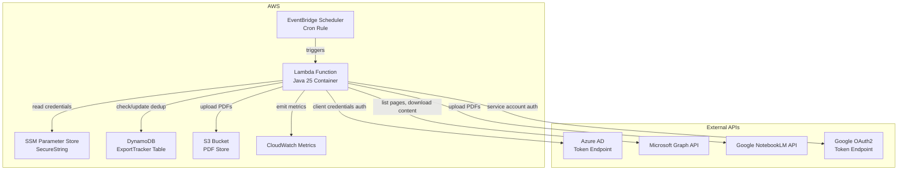
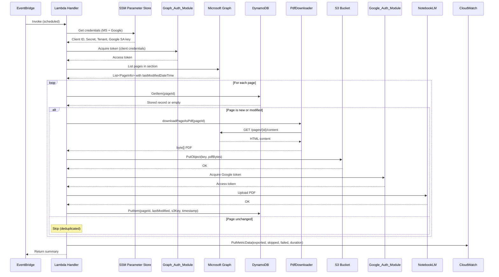

# Design Document: AWS Automated Pipeline

## Overview

This design migrates the existing OneNote PDF Extractor CLI tool to an automated, serverless pipeline on AWS. The current tool uses interactive OAuth2 device code flow, writes PDFs to local disk, and runs as a one-shot CLI invocation. The new pipeline replaces interactive auth with client credentials flow, stores PDFs in S3, tracks exported pages in DynamoDB for deduplication, uploads PDFs to Google NotebookLM, and runs on a schedule via EventBridge.

The Java 25 application is packaged as a container image and executed on AWS Lambda (or ECS Fargate for longer runs). The existing components — `GraphClientWrapper`, `PdfDownloader`, `PdfWriter`, `PageLister`, `SectionResolver` — are adapted rather than rewritten. New components handle DynamoDB deduplication, S3 storage, NotebookLM upload, and non-interactive authentication.

### Key Design Decisions

1. **AWS Lambda with container image** — The export pipeline is I/O-bound (HTTP calls to Graph API, S3, DynamoDB, Google API). Lambda supports up to 15 minutes of execution and container images up to 10 GB, which is sufficient for the Java 25 runtime. If sections exceed 15 minutes, the design supports an ECS Fargate fallback.

2. **Client credentials flow replaces device code flow** — Microsoft Graph supports app-only access via client credentials with `Sites.Read.All` or `Notes.Read.All` application permissions (requires Azure AD admin consent). This eliminates interactive prompts entirely.

3. **DynamoDB for deduplication** — A single-table design keyed on `pageId` with `lastModifiedTimestamp` as an attribute. DynamoDB's low-latency reads make per-page dedup checks fast even at scale.

4. **S3 for PDF storage** — Durable, cost-effective storage with deterministic key paths for easy retrieval.

5. **Step Functions not used** — The pipeline is a single linear workflow (list → filter → export → upload). A Step Functions state machine adds complexity without benefit. The Java application handles orchestration internally using structured concurrency.

## Architecture



### Execution Flow



## Components and Interfaces

### New Components

#### 1. `PipelineHandler` (Lambda entry point)
Replaces `OneNotePdfExtractor` as the orchestrator. Implements `RequestHandler<ScheduledEvent, PipelineResult>`.

```java
package com.extractor.pipeline;

public class PipelineHandler implements RequestHandler<ScheduledEvent, PipelineResult> {
    PipelineResult handleRequest(ScheduledEvent event, Context context);
}
```

#### 2. `GraphCredentialsAuthModule` (replaces `AuthModule`)
Acquires tokens via OAuth2 client credentials flow using MSAL4J `ConfidentialClientApplication`.

```java
package com.extractor.auth;

public class GraphCredentialsAuthModule {
    GraphCredentialsAuthModule(String clientId, String clientSecret, String tenantId);
    String getAccessToken();
}
```

#### 3. `DeduplicationStore`
DynamoDB-backed tracker for exported pages.

```java
package com.extractor.dedup;

public class DeduplicationStore {
    DeduplicationStore(DynamoDbClient dynamoDb, String tableName);
    Optional<ExportRecord> getExportRecord(String pageId);
    void recordExport(ExportRecord record);
    boolean shouldExport(String pageId, Instant lastModified);
}
```

#### 4. `S3PdfStore` (replaces `PdfWriter` for cloud storage)
Uploads PDFs to S3 with deterministic key paths.

```java
package com.extractor.storage;

public class S3PdfStore {
    S3PdfStore(S3Client s3, String bucketName);
    String uploadPdf(String notebook, String section, String sanitizedTitle, byte[] pdfBytes);
}
```

#### 5. `NotebookLmUploader`
Uploads PDFs to Google NotebookLM.

```java
package com.extractor.notebooklm;

public class NotebookLmUploader {
    NotebookLmUploader(String projectId, GoogleCredentials credentials);
    void uploadPdf(String fileName, byte[] pdfBytes);
}
```

#### 6. `GoogleAuthModule`
Acquires Google API tokens from a service account key stored in SSM.

```java
package com.extractor.auth;

public class GoogleAuthModule {
    GoogleAuthModule(String serviceAccountJson);
    GoogleCredentials getCredentials();
}
```

#### 7. `CredentialLoader`
Reads all credentials from SSM Parameter Store.

```java
package com.extractor.config;

public class CredentialLoader {
    CredentialLoader(SsmClient ssm, String parameterPrefix);
    PipelineCredentials loadAll();
}

public record PipelineCredentials(
    String msClientId,
    String msClientSecret,
    String msTenantId,
    String googleServiceAccountJson,
    String notebookLmProjectId,
    String sectionId
) {}
```

#### 8. `MetricsPublisher`
Emits CloudWatch metrics for pipeline runs.

```java
package com.extractor.metrics;

public class MetricsPublisher {
    MetricsPublisher(CloudWatchClient cloudWatch, String namespace);
    void publishRunMetrics(int exported, int skipped, int failed, long durationMs);
}
```

### Adapted Existing Components

| Component | Change |
|---|---|
| `GraphClientWrapper` | No change — already accepts `AuthModule` interface. Will accept `GraphCredentialsAuthModule` via a shared interface or adapter. |
| `PdfDownloader` | No change — stateless, depends only on `GraphClientWrapper`. |
| `PageLister` | Minor change — needs to also return `lastModifiedDateTime` in `PageInfo`. |
| `SectionResolver` | Minor change — for app-only permissions, uses `/users/{userId}/onenote/sections` instead of `/me/onenote/sections`. |
| `PdfWriter` | Retained for local testing; `S3PdfStore` replaces it in production. |

### Interface Extraction

To allow `GraphClientWrapper` to work with both `AuthModule` (device code) and `GraphCredentialsAuthModule` (client credentials), extract a common interface:

```java
package com.extractor.auth;

public interface TokenProvider {
    String getAccessToken();
}
```

Both `AuthModule` and `GraphCredentialsAuthModule` implement `TokenProvider`. `GraphClientWrapper` depends on `TokenProvider` instead of `AuthModule` directly.

### PageInfo Enhancement

Add `lastModifiedDateTime` to support deduplication:

```java
public record PageInfo(
    String pageId,
    String title,
    Instant createdDateTime,
    Instant lastModifiedDateTime
) {}
```

## Data Models

### DynamoDB Table: `ExportTracker`

| Attribute | Type | Key | Description |
|---|---|---|---|
| `pageId` | String | Partition Key | OneNote page ID |
| `lastModifiedTimestamp` | String (ISO-8601) | — | Last-modified timestamp from Graph API |
| `s3Key` | String | — | S3 object key of the exported PDF |
| `exportTimestamp` | String (ISO-8601) | — | When the export was performed |
| `notebookLmUploaded` | Boolean | — | Whether the PDF was uploaded to NotebookLM |

### ExportRecord (Java record)

```java
package com.extractor.dedup;

public record ExportRecord(
    String pageId,
    Instant lastModifiedTimestamp,
    String s3Key,
    Instant exportTimestamp,
    boolean notebookLmUploaded
) {}
```

### PipelineResult (Java record)

```java
package com.extractor.pipeline;

public record PipelineResult(
    int totalPages,
    int exportedCount,
    int skippedCount,
    int failedCount,
    int uploadedToNotebookLmCount,
    long durationMs,
    List<FailedPage> failures
) {}
```

### S3 Key Format

```
{notebook-name}/{section-name}/{sanitized-page-title}.pdf
```

Example: `Research-Papers/Distributed-Systems/Spanner_TrueTime_and_the_CAP_Theorem.pdf`

The sanitization logic from `PdfWriter.sanitizeFilename()` is reused. No collision suffix is needed because S3 keys are deterministic and overwrites are intentional for updated pages.

### SSM Parameter Store Layout

| Parameter Path | Type | Description |
|---|---|---|
| `/{prefix}/ms-client-id` | SecureString | Azure AD app client ID |
| `/{prefix}/ms-client-secret` | SecureString | Azure AD app client secret |
| `/{prefix}/ms-tenant-id` | SecureString | Azure AD tenant ID |
| `/{prefix}/google-service-account-json` | SecureString | Google service account key JSON |
| `/{prefix}/notebooklm-project-id` | SecureString | NotebookLM project/notebook ID |
| `/{prefix}/section-id` | String | OneNote section ID to export |


## Correctness Properties

*A property is a characteristic or behavior that should hold true across all valid executions of a system — essentially, a formal statement about what the system should do. Properties serve as the bridge between human-readable specifications and machine-verifiable correctness guarantees.*

### Property 1: Deduplication decision correctness

*For any* page with a `pageId` and `lastModifiedDateTime`, and any stored `ExportRecord` (or absence thereof), `shouldExport` returns `true` if and only if no record exists for that `pageId` OR the page's `lastModifiedDateTime` is strictly after the stored `lastModifiedTimestamp`.

**Validates: Requirements 3.3, 3.4**

### Property 2: Export record round-trip

*For any* valid `ExportRecord` containing a `pageId`, `lastModifiedTimestamp`, `s3Key`, `exportTimestamp`, and `notebookLmUploaded` flag, storing the record in the `DeduplicationStore` and then retrieving it by `pageId` produces an equivalent record.

**Validates: Requirements 3.2, 3.5**

### Property 3: S3 key determinism

*For any* notebook name, section name, and page title, the generated S3 key is deterministic — calling the key generation function twice with the same inputs produces the same key, and the key follows the format `{sanitized_notebook}/{sanitized_section}/{sanitized_title}.pdf`.

**Validates: Requirements 4.2, 4.3**

### Property 4: Retry behavior

*For any* operation that fails with a retryable error, the retry mechanism attempts the operation at most 3 additional times with exponentially increasing delays before propagating the failure. If the operation succeeds on any retry attempt, the successful result is returned immediately.

**Validates: Requirements 2.3, 4.5, 5.3**

### Property 5: Token caching

*For any* sequence of `getAccessToken()` calls where the cached token has not expired, the `GraphCredentialsAuthModule` returns the same token without making additional network requests to the token endpoint.

**Validates: Requirements 2.4**

### Property 6: No sensitive values in logs

*For any* credential value (client secret, access token, service account JSON), after a complete pipeline run, the log output does not contain that credential value as a substring.

**Validates: Requirements 6.2**

### Property 7: Missing credential error identification

*For any* SSM parameter name that is missing from the Credential_Store, the `CredentialLoader` throws an exception whose message contains the missing parameter's path.

**Validates: Requirements 6.3**

### Property 8: Run summary completeness

*For any* `PipelineResult` with arbitrary counts for total, exported, skipped, failed, and uploaded pages, the formatted summary string contains all five numeric values.

**Validates: Requirements 7.1**

### Property 9: Failure detail reporting

*For any* non-empty list of `FailedPage` records, the formatted failure log contains the `pageId`, `pageTitle`, and `errorMessage` of every failed page.

**Validates: Requirements 7.2**

### Property 10: Metrics match pipeline result

*For any* `PipelineResult`, the metrics published to CloudWatch contain metric values that exactly match the `exportedCount`, `skippedCount`, `failedCount`, and `durationMs` from the result.

**Validates: Requirements 7.3**

### Property 11: NotebookLM upload status recorded

*For any* page that is successfully uploaded to NotebookLM, the corresponding `ExportRecord` in the `DeduplicationStore` has `notebookLmUploaded` set to `true`.

**Validates: Requirements 5.4**

### Property 12: Fault isolation

*For any* list of pages where a subset of exports fail, the pipeline still attempts to process every page in the list. The sum of exported, skipped, and failed counts equals the total page count.

**Validates: Requirements 8.3**

### Property 13: Every page gets dedup check

*For any* list of pages returned by the `PageLister`, the pipeline queries the `DeduplicationStore` exactly once per page before deciding whether to export.

**Validates: Requirements 3.1**

## Error Handling

### Authentication Failures

- **Microsoft Graph token failure**: `GraphCredentialsAuthModule` retries 3 times with exponential backoff. If all retries fail, the pipeline logs the error (without credentials) and terminates with a non-zero exit. The Lambda invocation is marked as failed, and CloudWatch alarms can trigger on consecutive failures.
- **Google token failure**: Same retry pattern. If Google auth fails, pages are still exported to S3 but NotebookLM upload is skipped. The `notebookLmUploaded` flag remains `false` in DynamoDB for retry on the next run.

### Page Export Failures

- Individual page failures do not abort the pipeline (fault isolation — Property 12).
- Each failure is recorded as a `FailedPage` with page ID, title, and error message.
- Failed pages are not marked in the `DeduplicationStore`, so they will be retried on the next scheduled run.

### S3 Upload Failures

- Retried 3 times with exponential backoff via the shared retry utility.
- If all retries fail, the page is recorded as failed. The DynamoDB record is not updated, ensuring the page is retried next run.

### NotebookLM Upload Failures

- Retried 3 times. If all retries fail, the S3 upload is still considered successful (the PDF is durably stored).
- The `notebookLmUploaded` flag stays `false`, so the next run will attempt the NotebookLM upload again for pages where S3 has the PDF but NotebookLM doesn't.

### DynamoDB Failures

- If the dedup check fails for a page, the pipeline treats the page as needing export (fail-open strategy to avoid missing updates).
- If the record update fails after export, the page may be re-exported on the next run (idempotent — S3 overwrites are safe).

### Missing Credentials

- `CredentialLoader` validates all required parameters at startup. If any are missing, the pipeline fails immediately with a descriptive error naming the missing parameter (Property 7).

## Testing Strategy

### Property-Based Testing

Property-based tests use **jqwik** (already in the project's test dependencies) to verify universal properties across generated inputs. Each property test runs a minimum of 100 iterations.

| Property | Component Under Test | Generator Strategy |
|---|---|---|
| P1: Dedup decision | `DeduplicationStore.shouldExport` | Random `pageId`, random `Instant` pairs (stored vs current), including null stored record |
| P2: Export record round-trip | `DeduplicationStore` | Random `ExportRecord` instances with arbitrary field values |
| P3: S3 key determinism | `S3PdfStore.generateKey` | Random notebook/section/title strings including unicode, spaces, special chars |
| P4: Retry behavior | `RetryExecutor` | Random failure counts (0–4), random success positions |
| P5: Token caching | `GraphCredentialsAuthModule` | Random token strings, random expiration times relative to "now" |
| P6: No secrets in logs | `PipelineHandler` (integration) | Random credential strings, verify absence in captured log output |
| P7: Missing credential error | `CredentialLoader` | Random parameter names, random subsets of missing parameters |
| P8: Summary completeness | `PipelineReporter.formatSummary` | Random `PipelineResult` with arbitrary counts |
| P9: Failure details | `PipelineReporter.formatFailures` | Random lists of `FailedPage` with arbitrary strings |
| P10: Metrics match | `MetricsPublisher` | Random `PipelineResult`, verify captured metric values |
| P11: Upload status | `DeduplicationStore` + pipeline integration | Random pages with successful NotebookLM upload |
| P12: Fault isolation | Pipeline orchestrator | Random page lists with random failure injection |
| P13: Dedup check coverage | Pipeline orchestrator | Random page lists, verify dedup store queried for each |

### Unit Testing

Unit tests complement property tests by covering specific examples and edge cases:

- **CredentialLoader**: Missing individual parameters, empty strings, SSM client errors
- **S3PdfStore**: Empty title fallback to page ID, very long titles truncated, special character sanitization
- **DeduplicationStore**: DynamoDB conditional write conflicts, item not found responses
- **GraphCredentialsAuthModule**: Token expiration boundary (token expires exactly now), MSAL4J exception types
- **PipelineHandler**: Zero pages in section, all pages deduplicated, all pages fail
- **NotebookLmUploader**: HTTP 4xx vs 5xx error handling, empty PDF bytes

### Testing Configuration

- jqwik property tests: minimum 100 tries per property
- Each property test tagged with: `Feature: aws-automated-pipeline, Property {N}: {title}`
- Mockito for mocking AWS SDK clients (DynamoDB, S3, SSM, CloudWatch) and external HTTP calls
- AssertJ for fluent assertions
- Tests run via Maven Surefire with `--enable-preview` flag (already configured in pom.xml)
