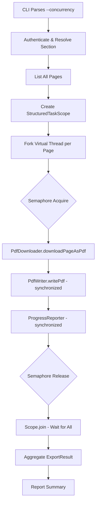
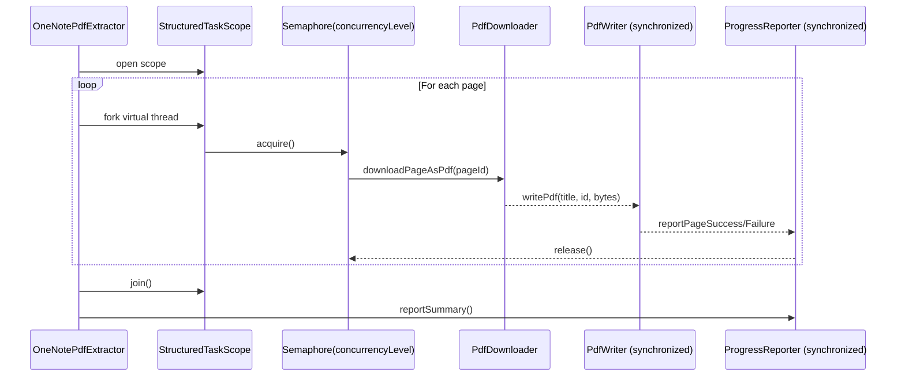

# Design Document: Concurrent Export Pipeline

## Overview

This design transforms the sequential page export loop in `OneNotePdfExtractor.call()` into a concurrent pipeline using JDK 25 virtual threads and structured concurrency. The key insight is that the bottleneck is I/O-bound HTTP downloads in `PdfDownloader` — these are ideal candidates for virtual threads, which can handle thousands of concurrent I/O operations with minimal overhead.

The approach uses a `Semaphore` to throttle concurrency to the user-configured level, `StructuredTaskScope` to manage task lifecycles, and targeted synchronization in `PdfWriter` and `ProgressReporter` to ensure thread safety without excessive locking.

## Architecture

### High-Level Flow



### Concurrency Model

The design uses a **bounded fork-join** pattern:

1. A `StructuredTaskScope.ShutdownOnFailure` or a custom scope forks one virtual thread per page
2. A `Semaphore` with `concurrencyLevel` permits bounds the number of simultaneously active downloads
3. Each virtual thread acquires a permit before downloading, releases it after writing
4. The scope's `join()` waits for all tasks to complete
5. Results are collected from each task's `Callable` return value

Virtual threads are the right choice here because:
- Each page export is I/O-bound (HTTP download + disk write)
- Virtual threads have near-zero creation cost
- The JVM efficiently parks virtual threads during I/O waits
- `Semaphore` naturally throttles without a fixed thread pool

### Component Interaction



## Components and Interfaces

### Modified Components

#### 1. `OneNotePdfExtractor` (Orchestrator)

Changes:
- Add `--concurrency` CLI option via picocli `@Option`
- Replace the sequential for-loop with a `StructuredTaskScope`-based concurrent pipeline
- Fork one virtual thread per page, throttled by a `Semaphore`
- Collect results from each task into a thread-safe list
- Aggregate into `ExportResult` after `scope.join()`

```java
// New CLI option
@Option(names = "--concurrency",
        description = "Max concurrent page exports (default: ${DEFAULT-VALUE})",
        defaultValue = "4")
private int concurrency;
```

New method signature for the concurrent export:
```java
/**
 * Exports pages concurrently using virtual threads and structured concurrency.
 * Returns an ExportResult summarizing successes and failures.
 */
ExportResult exportPagesConcurrently(
    List<PageInfo> pages,
    PdfDownloader downloader,
    PdfWriter writer,
    ProgressReporter reporter,
    int concurrencyLevel
)
```

#### 2. `PdfWriter` — Thread-Safe Filename Resolution

Changes:
- Replace `HashSet<String> usedFilenames` with `ConcurrentHashMap.newKeySet()` (a concurrent `Set`)
- Synchronize the `writePdf` method to make the check-then-act sequence (collision check → register filename → write file) atomic
- The `sanitizeFilename` static method is already stateless and thread-safe

```java
public class PdfWriter {
    private final Set<String> usedFilenames = ConcurrentHashMap.newKeySet();

    public synchronized String writePdf(String pageTitle, String pageId, byte[] pdfContent)
            throws IOException {
        // collision resolution + registration + file write are atomic
    }
}
```

Design decision: `synchronized` on the entire `writePdf` is acceptable because the critical section is short (filename resolution + one file write). The bottleneck is the HTTP download, not disk I/O. A finer-grained lock (e.g., lock-per-filename) would add complexity without meaningful throughput gain.

#### 3. `ProgressReporter` — Thread-Safe Output

Changes:
- Synchronize the `output` method to prevent interleaved lines
- Synchronize `reportSummary` to ensure the multi-line summary block is atomic
- The `PrintWriter` is already auto-flushing; synchronization ensures ordering

```java
public class ProgressReporter {
    private synchronized void output(String message) {
        System.out.println(message);
        logWriter.println(message);
    }

    public synchronized void reportSummary(int totalPages, int successCount, List<FailedPage> failures) {
        // entire summary block is atomic
    }
}
```

Design decision: Method-level `synchronized` on the `ProgressReporter` instance is sufficient. All reporting methods delegate to `output`, so synchronizing at that level prevents interleaving. `reportSummary` needs its own `synchronized` because it calls `output` multiple times and the entire block must be atomic.

#### 4. `CliArgs` — Concurrency Validation

Changes:
- Add `concurrency` field with default value of 4
- Add validation in `validate()`: reject values < 1 or > 20

```java
public class CliArgs {
    private int concurrency = 4;

    public void validate() {
        // existing validation...
        if (concurrency < 1 || concurrency > 20) {
            throw new IllegalArgumentException(
                "--concurrency must be between 1 and 20 (inclusive).");
        }
    }
}
```

### New Components

#### 5. `PageExportTask` — Single Page Export Unit

A record encapsulating the result of a single page export attempt:

```java
public sealed interface PageExportOutcome {
    record Success(String pageTitle, String filename) implements PageExportOutcome {}
    record Failure(String pageId, String pageTitle, String errorMessage) implements PageExportOutcome {}
}
```

This sealed interface with pattern matching lets the orchestrator cleanly aggregate results:

```java
switch (outcome) {
    case PageExportOutcome.Success s -> successCount++;
    case PageExportOutcome.Failure f -> failures.add(new FailedPage(f.pageId(), f.pageTitle(), f.errorMessage()));
}
```

## Data Models

### New Types

#### `PageExportOutcome` (sealed interface)

```java
public sealed interface PageExportOutcome
    permits PageExportOutcome.Success, PageExportOutcome.Failure {

    record Success(String pageTitle, String filename) implements PageExportOutcome {}
    record Failure(String pageId, String pageTitle, String errorMessage) implements PageExportOutcome {}
}
```

### Modified Types

#### `CliArgs` — New Field

| Field | Type | Default | Validation |
|-------|------|---------|------------|
| `concurrency` | `int` | `4` | 1 ≤ value ≤ 20 |

#### `ExportResult` — No Changes

The existing `ExportResult` record already captures everything needed. The concurrent pipeline aggregates into the same structure.

### Thread Safety Summary

| Component | Strategy | Rationale |
|-----------|----------|-----------|
| `PdfWriter.writePdf` | `synchronized` method | Short critical section; filename resolution + file write must be atomic |
| `PdfWriter.usedFilenames` | `ConcurrentHashMap.newKeySet()` | Concurrent set for safe reads during collision checks |
| `ProgressReporter.output` | `synchronized` method | Prevents interleaved lines on stdout and log file |
| `ProgressReporter.reportSummary` | `synchronized` method | Multi-line summary must be atomic |
| `PdfDownloader` | No changes needed | Stateless; `GraphClientWrapper` is used read-only per request |
| Result collection | `ConcurrentLinkedQueue<PageExportOutcome>` | Lock-free collection of results from virtual threads |


## Correctness Properties

*A property is a characteristic or behavior that should hold true across all valid executions of a system — essentially, a formal statement about what the system should do. Properties serve as the bridge between human-readable specifications and machine-verifiable correctness guarantees.*

### Property 1: All pages produce a result

*For any* list of pages and any concurrency level in [1, 20], after the Export_Pipeline completes, the number of results (successes + failures) in the ExportResult SHALL equal the total number of input pages.

**Validates: Requirements 1.1, 1.3, 5.1, 5.2**

### Property 2: Concurrency level is respected

*For any* concurrency level N in [1, 20] and any list of pages, the number of simultaneously active Page_Export_Tasks SHALL never exceed N at any point during execution.

**Validates: Requirements 1.2**

### Property 3: Invalid concurrency values are rejected

*For any* integer outside the range [1, 20], the CLI validation SHALL reject the value and throw an IllegalArgumentException.

**Validates: Requirements 2.3, 2.4**

### Property 4: Valid concurrency values are accepted

*For any* integer in the range [1, 20], the CLI validation SHALL accept the value and store it as the concurrency level.

**Validates: Requirements 2.5**

### Property 5: Concurrent writes produce unique filenames

*For any* set of page titles (including duplicates) written concurrently through PdfWriter, all resulting filenames SHALL be unique.

**Validates: Requirements 3.1**

### Property 6: Written files are complete and registered

*For any* set of pages written concurrently through PdfWriter, every filename in the `usedFilenames` set SHALL correspond to a non-empty file on disk.

**Validates: Requirements 3.3**

### Property 7: Concurrent progress messages are not interleaved

*For any* set of progress messages written concurrently through ProgressReporter, every line in the log file SHALL be a complete, well-formed message matching the expected format.

**Validates: Requirements 4.1**

### Property 8: Success messages contain required fields

*For any* page title and output filename, the success message produced by ProgressReporter SHALL contain both the page title and the filename.

**Validates: Requirements 4.2**

### Property 9: Failure messages contain required fields

*For any* page title, page ID, and error description, the failure message produced by ProgressReporter SHALL contain all three values.

**Validates: Requirements 4.3**

### Property 10: Summary contains correct counts

*For any* combination of total page count, success count, and failure list, the summary output by ProgressReporter SHALL contain all three numeric values.

**Validates: Requirements 4.4**

### Property 11: Failures produce non-zero exit code

*For any* ExportResult where the failures list is non-empty, the Export_Pipeline SHALL return a non-zero exit code.

**Validates: Requirements 5.4**

### Property 12: Concurrent output matches sequential output (model-based)

*For any* list of pages with deterministic download/write behavior, the set of output files (by filename and content) produced by the concurrent pipeline SHALL be identical to the set produced by the sequential implementation.

**Validates: Requirements 6.1**

## Error Handling

### Page-Level Errors

Each Page_Export_Task catches all exceptions internally and returns a `PageExportOutcome.Failure` instead of propagating. This ensures:
- The `StructuredTaskScope` does not shut down on individual page failures
- All other in-flight tasks continue to completion
- The failure is recorded with page ID, title, and error message

### Pipeline-Level Errors

If an unrecoverable error occurs (e.g., `StructuredTaskScope.join()` is interrupted, or the scope itself fails):
- The scope's `close()` method cancels all in-flight virtual threads
- The error is reported to stderr
- The process exits with code 1

### Semaphore Interruption

If a virtual thread is interrupted while waiting on `Semaphore.acquire()`:
- The `InterruptedException` is caught and converted to a `PageExportOutcome.Failure`
- The semaphore permit is not consumed, so other tasks are unaffected

### Resource Cleanup

- `ProgressReporter.close()` is called in a `finally` block after the scope completes
- `StructuredTaskScope` is used with try-with-resources for automatic cleanup
- The `Semaphore` requires no explicit cleanup

## Testing Strategy

### Property-Based Testing

- Library: **jqwik** (already in pom.xml as a test dependency)
- Minimum 100 iterations per property test (jqwik default is 1000, which exceeds this)
- Each property test is tagged with a comment referencing the design property:
  ```java
  // Feature: concurrent-export-pipeline, Property 5: Concurrent writes produce unique filenames
  ```
- Each correctness property is implemented by a single `@Property` method

### Unit Testing

- Framework: **JUnit 5** with **Mockito** for mocking `GraphClientWrapper`
- Unit tests focus on:
  - CLI parsing of `--concurrency` option (examples for default value, valid values)
  - Edge cases: zero pages, single page, all pages fail
  - `PageExportOutcome` pattern matching
  - `ProgressReporter` message formatting for specific inputs
  - Unrecoverable error handling (scope interruption)

### Concurrency Testing Approach

For properties involving concurrent execution (Properties 2, 5, 6, 7):
- Use `AtomicInteger` or `LongAdder` to track peak concurrency in test doubles
- Use `CountDownLatch` or `CyclicBarrier` to force thread interleaving
- Use a mock `PdfDownloader` that introduces controlled delays to simulate I/O
- Use a temporary directory (`@TempDir`) for PdfWriter file system tests

### Test Organization

| Property | Test Class | Type |
|----------|-----------|------|
| Property 1 | `ConcurrentExportPipelinePropertyTest` | jqwik @Property |
| Property 2 | `ConcurrentExportPipelinePropertyTest` | jqwik @Property |
| Property 3 | `CliArgsPropertyTest` | jqwik @Property |
| Property 4 | `CliArgsPropertyTest` | jqwik @Property |
| Property 5 | `PdfWriterConcurrencyPropertyTest` | jqwik @Property |
| Property 6 | `PdfWriterConcurrencyPropertyTest` | jqwik @Property |
| Property 7 | `ProgressReporterConcurrencyPropertyTest` | jqwik @Property |
| Property 8 | `ProgressReporterPropertyTest` | jqwik @Property |
| Property 9 | `ProgressReporterPropertyTest` | jqwik @Property |
| Property 10 | `ProgressReporterPropertyTest` | jqwik @Property |
| Property 11 | `ConcurrentExportPipelinePropertyTest` | jqwik @Property |
| Property 12 | `ConcurrentExportPipelinePropertyTest` | jqwik @Property |
