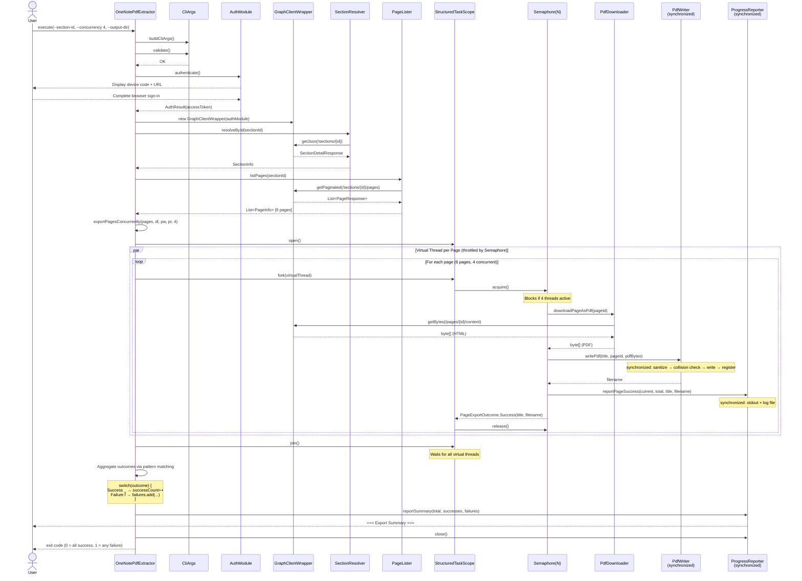
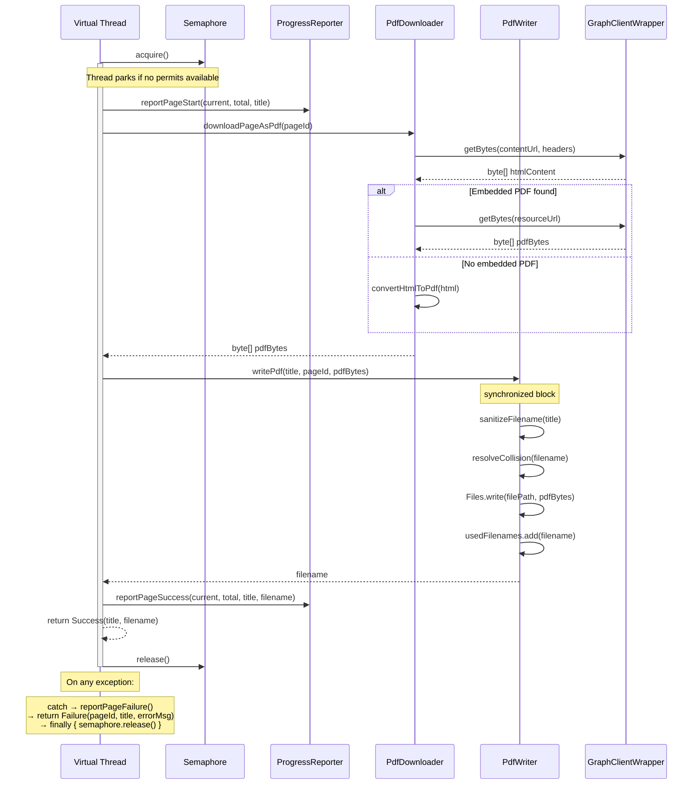
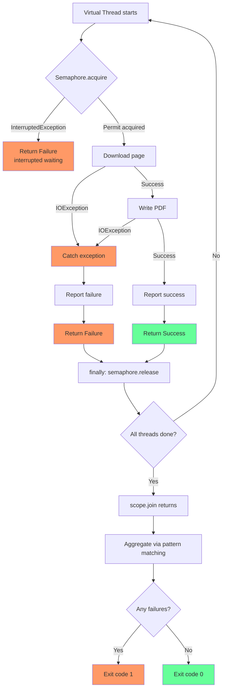

# Architecture Guide — OneNote PDF Extractor

## Overview

The OneNote PDF Extractor is a CLI tool that exports OneNote pages as PDF files via the Microsoft Graph API. It authenticates using OAuth2 device code flow, resolves a target notebook section, lists all pages, and exports each page to a local PDF file. The export pipeline uses JDK 25 virtual threads and structured concurrency to process pages in parallel, throttled by a configurable semaphore.

---

## Package Structure

```
com.extractor
├── OneNotePdfExtractor        # CLI entry point & pipeline orchestrator
├── auth/
│   └── AuthModule             # OAuth2 device code flow via MSAL4J
├── cli/
│   └── CliArgs                # Parsed & validated CLI arguments
├── client/
│   ├── GraphClientWrapper     # Authenticated HTTP client with retry logic
│   ├── NotebookResponse       # DTO for notebook JSON
│   ├── SectionResponse        # DTO for section JSON
│   ├── PageResponse           # DTO for page JSON
│   └── ODataPagedResponse     # Generic OData pagination wrapper
├── model/
│   ├── AuthResult             # record(accessToken, refreshToken, expiresAt)
│   ├── PageInfo               # record(pageId, title, createdDateTime)
│   ├── SectionInfo            # record(sectionId, sectionName, notebookName, pageCount)
│   ├── ExportResult           # record(totalPages, successCount, failureCount, failures)
│   ├── FailedPage             # record(pageId, pageTitle, errorMessage)
│   └── PageExportOutcome      # sealed interface { Success | Failure }
├── page/
│   └── PageLister             # Lists pages in a section via Graph API
├── pdf/
│   ├── PdfDownloader          # Downloads page content, converts HTML→PDF
│   └── PdfWriter              # Writes PDF to disk with collision handling (synchronized)
├── report/
│   └── ProgressReporter       # Thread-safe stdout + log file output
└── section/
    └── SectionResolver        # Resolves section by ID or notebook/section name
```

---

## Object Diagram

Shows the runtime object graph during a concurrent export with `--concurrency 4` and 6 pages.

```mermaid
classDiagram
    direction TB

    class extractor_OneNotePdfExtractor {
        concurrency = 4
    }

    class cliArgs_CliArgs {
        sectionId = "abc-123"
        concurrency = 4
        outputDir = "./onenote-export"
    }

    class authModule_AuthModule {
        scopes = Notes.Read, Notes.Read.All
    }

    class graphClient_GraphClientWrapper {
        MAX_RETRIES = 3
    }

    class sectionResolver_SectionResolver

    class pageLister_PageLister

    class downloader_PdfDownloader

    class writer_PdfWriter {
        usedFilenames : ConcurrentHashMap.KeySetView
    }

    class reporter_ProgressReporter {
        logWriter : PrintWriter auto-flush
    }

    class semaphore_Semaphore {
        permits = 4
    }

    class scope_StructuredTaskScope

    class outcomes_ConcurrentLinkedQueue

    extractor_OneNotePdfExtractor --> cliArgs_CliArgs
    extractor_OneNotePdfExtractor --> authModule_AuthModule
    extractor_OneNotePdfExtractor --> graphClient_GraphClientWrapper
    extractor_OneNotePdfExtractor --> sectionResolver_SectionResolver
    extractor_OneNotePdfExtractor --> pageLister_PageLister
    extractor_OneNotePdfExtractor --> downloader_PdfDownloader
    extractor_OneNotePdfExtractor --> writer_PdfWriter
    extractor_OneNotePdfExtractor --> reporter_ProgressReporter
    extractor_OneNotePdfExtractor --> semaphore_Semaphore
    extractor_OneNotePdfExtractor --> scope_StructuredTaskScope
    extractor_OneNotePdfExtractor --> outcomes_ConcurrentLinkedQueue

    sectionResolver_SectionResolver --> graphClient_GraphClientWrapper
    pageLister_PageLister --> graphClient_GraphClientWrapper
    downloader_PdfDownloader --> graphClient_GraphClientWrapper
    authModule_AuthModule ..> graphClient_GraphClientWrapper : provides token
```




---

## Sequence Diagram — Full Export Pipeline

Shows the end-to-end flow from CLI invocation through concurrent page export to final summary.



---

## Sequence Diagram — Single Page Export Task (Virtual Thread)

Zooms into what happens inside each forked virtual thread, including error handling.



---

## Concurrency Model

```
┌─────────────────────────────────────────────────────────┐
│                  OneNotePdfExtractor.call()              │
│                                                         │
│  ┌───────────────────────────────────────────────────┐  │
│  │         StructuredTaskScope (try-with-resources)   │  │
│  │                                                    │  │
│  │   Semaphore(concurrencyLevel)                      │  │
│  │   ┌──────┐ ┌──────┐ ┌──────┐ ┌──────┐             │  │
│  │   │ VT-1 │ │ VT-2 │ │ VT-3 │ │ VT-4 │  ← active  │  │
│  │   └──┬───┘ └──┬───┘ └──┬───┘ └──┬───┘             │  │
│  │      │        │        │        │                  │  │
│  │   ┌──────┐ ┌──────┐                               │  │
│  │   │ VT-5 │ │ VT-6 │  ← waiting for permit         │  │
│  │   └──────┘ └──────┘                               │  │
│  │                                                    │  │
│  │   scope.join() ← waits for all 6 to complete       │  │
│  └───────────────────────────────────────────────────┘  │
│                                                         │
│  Aggregate: ConcurrentLinkedQueue<PageExportOutcome>    │
│  Pattern match → ExportResult(total, success, failures) │
└─────────────────────────────────────────────────────────┘
```

### Thread Safety Summary

| Component | Strategy | Why |
|---|---|---|
| `PdfWriter.writePdf` | `synchronized` method | Filename collision check → register → write must be atomic |
| `PdfWriter.usedFilenames` | `ConcurrentHashMap.newKeySet()` | Safe concurrent reads during collision checks |
| `ProgressReporter.output` | `synchronized` method | Prevents interleaved lines on stdout and log |
| `ProgressReporter.reportSummary` | `synchronized` method | Multi-line summary block must be atomic |
| `PdfDownloader` | Stateless | No shared mutable state; `GraphClientWrapper` is read-only per request |
| Result collection | `ConcurrentLinkedQueue` | Lock-free collection from virtual threads |

---

## Error Handling Flow



---

## Key Design Decisions

1. **Virtual threads over platform thread pool** — Each page export is I/O-bound (HTTP download + disk write). Virtual threads have near-zero creation cost and the JVM efficiently parks them during I/O waits.

2. **Semaphore over fixed thread pool** — A `Semaphore(N)` naturally throttles concurrency without constraining the thread model. All pages get their own virtual thread immediately; the semaphore gates the expensive I/O work.

3. **`synchronized` over `ReentrantLock`** — The critical sections in `PdfWriter` and `ProgressReporter` are short. Method-level `synchronized` is simpler and sufficient; finer-grained locking would add complexity without meaningful throughput gain since the bottleneck is HTTP downloads.

4. **Sealed interface for outcomes** — `PageExportOutcome` with `Success | Failure` records enables exhaustive pattern matching via `switch` expressions, making result aggregation type-safe and compiler-verified.

5. **Structured concurrency** — `StructuredTaskScope` ensures all forked virtual threads are joined before the scope closes, preventing thread leaks and providing clean lifecycle management via try-with-resources.
