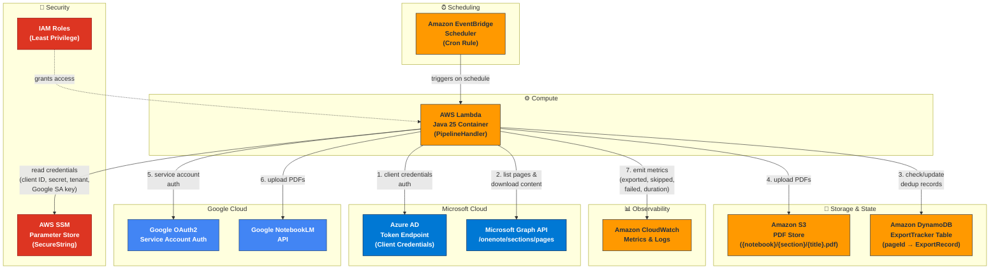
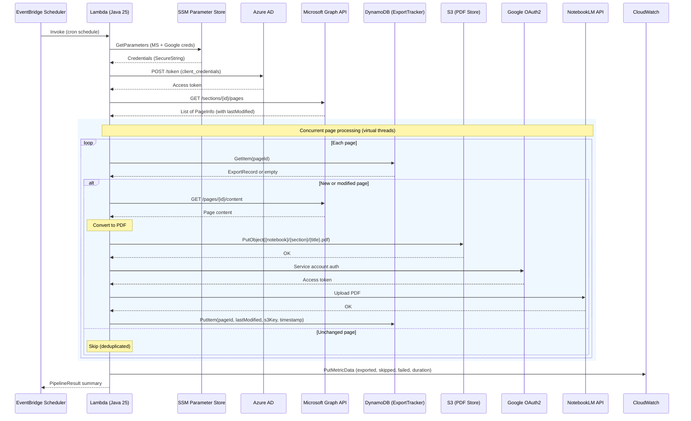
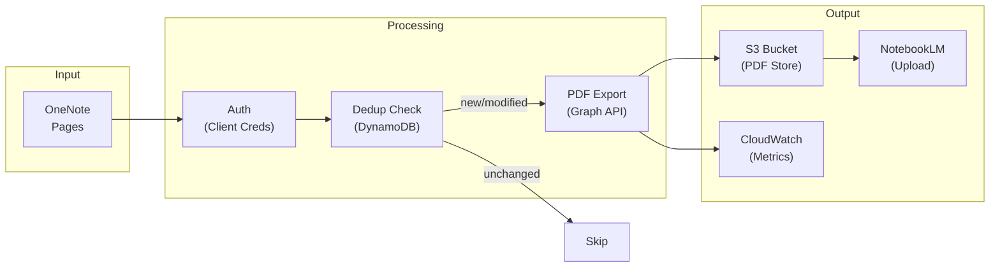

# AWS Automated Pipeline — Architecture Diagram

```mermaid
flowchart TB
    subgraph Scheduling["⏰ Scheduling"]
        EB["Amazon EventBridge\nScheduler\n(Cron Rule)"]
    end

    subgraph Compute["⚙️ Compute"]
        LF["AWS Lambda\nJava 25 Container\n(PipelineHandler)"]
    end

    subgraph Storage["💾 Storage & State"]
        S3["Amazon S3\nPDF Store\n({notebook}/{section}/{title}.pdf)"]
        DDB["Amazon DynamoDB\nExportTracker Table\n(pageId → ExportRecord)"]
    end

    subgraph Security["🔐 Security"]
        SSM["AWS SSM\nParameter Store\n(SecureString)"]
        IAM["IAM Roles\n(Least Privilege)"]
    end

    subgraph Observability["📊 Observability"]
        CW["Amazon CloudWatch\nMetrics & Logs"]
    end

    subgraph Microsoft["Microsoft Cloud"]
        AAD["Azure AD\nToken Endpoint\n(Client Credentials)"]
        GRAPH["Microsoft Graph API\n/onenote/sections/pages"]
    end

    subgraph Google["Google Cloud"]
        GAUTH["Google OAuth2\nService Account Auth"]
        NLM["Google NotebookLM\nAPI"]
    end

    %% Trigger
    EB -->|"triggers on schedule"| LF

    %% Credentials
    LF -->|"read credentials\n(client ID, secret, tenant,\nGoogle SA key)"| SSM
    IAM -.->|"grants access"| LF

    %% Microsoft Graph flow
    LF -->|"1. client credentials\nauth"| AAD
    LF -->|"2. list pages &\ndownload content"| GRAPH

    %% Deduplication
    LF -->|"3. check/update\ndedup records"| DDB

    %% S3 storage
    LF -->|"4. upload PDFs"| S3

    %% Google NotebookLM flow
    LF -->|"5. service account\nauth"| GAUTH
    LF -->|"6. upload PDFs"| NLM

    %% Observability
    LF -->|"7. emit metrics\n(exported, skipped,\nfailed, duration)"| CW

    %% Styling
    classDef aws fill:#FF9900,stroke:#232F3E,color:#232F3E,font-weight:bold
    classDef microsoft fill:#0078D4,stroke:#002050,color:white,font-weight:bold
    classDef google fill:#4285F4,stroke:#1A3B6B,color:white,font-weight:bold
    classDef security fill:#DD3522,stroke:#8B0000,color:white,font-weight:bold

    class EB,LF,S3,DDB,CW aws
    class SSM,IAM security
    class AAD,GRAPH microsoft
    class GAUTH,NLM google
```

## Execution Flow

```mermaid
sequenceDiagram
    participant EB as EventBridge Scheduler
    participant LF as Lambda (Java 25)
    participant SSM as SSM Parameter Store
    participant AAD as Azure AD
    participant Graph as Microsoft Graph API
    participant DDB as DynamoDB (ExportTracker)
    participant S3 as S3 (PDF Store)
    participant Google as Google OAuth2
    participant NLM as NotebookLM API
    participant CW as CloudWatch

    EB->>LF: Invoke (cron schedule)
    LF->>SSM: GetParameters (MS + Google creds)
    SSM-->>LF: Credentials (SecureString)

    LF->>AAD: POST /token (client_credentials)
    AAD-->>LF: Access token

    LF->>Graph: GET /sections/{id}/pages
    Graph-->>LF: List of PageInfo (with lastModified)

    rect rgb(240, 248, 255)
        Note over LF,NLM: Concurrent page processing (virtual threads)
        loop Each page
            LF->>DDB: GetItem(pageId)
            DDB-->>LF: ExportRecord or empty

            alt New or modified page
                LF->>Graph: GET /pages/{id}/content
                Graph-->>LF: Page content
                Note over LF: Convert to PDF

                LF->>S3: PutObject({notebook}/{section}/{title}.pdf)
                S3-->>LF: OK

                LF->>Google: Service account auth
                Google-->>LF: Access token
                LF->>NLM: Upload PDF
                NLM-->>LF: OK

                LF->>DDB: PutItem(pageId, lastModified, s3Key, timestamp)
            else Unchanged page
                Note over LF: Skip (deduplicated)
            end
        end
    end

    LF->>CW: PutMetricData (exported, skipped, failed, duration)
    LF-->>EB: PipelineResult summary
```

## Data Flow Summary

```mermaid
flowchart LR
    subgraph Input
        ON["OneNote\nPages"]
    end

    subgraph Processing
        AUTH["Auth\n(Client Creds)"]
        DEDUP["Dedup Check\n(DynamoDB)"]
        EXPORT["PDF Export\n(Graph API)"]
    end

    subgraph Output
        S3["S3 Bucket\n(PDF Store)"]
        NLM["NotebookLM\n(Upload)"]
        CW["CloudWatch\n(Metrics)"]
    end

    ON --> AUTH --> DEDUP
    DEDUP -->|"new/modified"| EXPORT
    DEDUP -->|"unchanged"| SKIP["Skip"]
    EXPORT --> S3 --> NLM
    EXPORT --> CW
```
